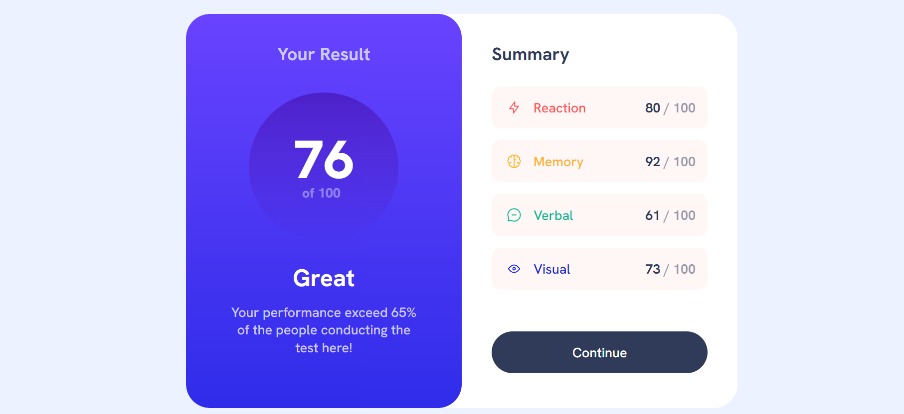

# Frontend Mentor - Results summary component solution

## Table of contents

- [Overview](#overview)
  - [Screenshot](#screenshot)
  - [Links](#links)
- [My process](#my-process)
  - [Built with](#built-with)
  - [What I learned](#what-i-learned)
  - [Continued development](#continued-development)
- [Acknowledgments](#acknowledgments)

## Overview

This is a solution to the [Results summary component challenge on Frontend Mentor](https://www.frontendmentor.io/challenges/results-summary-component-CE_K6s0maV).

### Screenshot

### Links

- Solution URL: [Solution URL here](https://your-solution-url.com)
- Live Site URL: [Live site URL here](https://your-live-site-url.com)

## My process

### Built with

- Semantic HTML5 markup
- CSS custom properties
- Flexbox
- CSS Grid
- Mobile-first workflow

### What I learned

I did not learn anything new while working through this project, but it was a good challenge for practising CSS flexbox knowledge.

### Continued development

I would like to focus more on flexbox and grid in future projects.

## Acknowledgments

I would like to thank Bitcamp 101 (Georgia) for amazing lectures, and also, my mentor Paata Gharibashvili who has helped me a lot while working on different projects.
